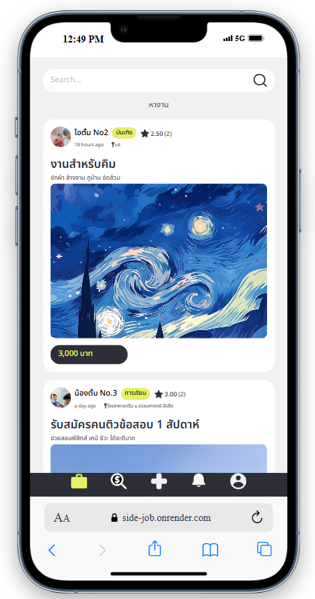

# SideJob

SideJob is a modern web application that bridges the gap between employers seeking temporary workforce solutions and students or young adults looking for flexible, non-permanent employment opportunities. The platform facilitates straightforward interactions through posting and responding to job opportunities.

## 📸 Screenshots


*Homepage of SideJob*

## 🌟 Key Features

- **Job Posting System**
  - Create and manage job posts with detailed descriptions
  - Set job categories, locations, and salary information
  - Upload multiple images for job posts
  - Toggle job post status (active/inactive)

- **Profile Management**
  - Customizable user profiles with profile pictures
  - Display contact information (phone, email, Line ID)
  - View created job posts and working history
  - Track user ratings and reviews

- **Job Application System**
  - Accept/reject job applications with confirmation dialogs
  - View working members on each job post
  - Real-time notification system
  - Track application status

- **Review & Rating System**
  - Rate and review job experiences
  - Calculate and display average ratings
  - View detailed review history
  - Profile-based rating aggregation

## 🛠️ Tech Stack

### Frontend
- React.js with Vite
- TanStack Query for data fetching
- React Router for navigation
- Moment.js for date handling
- Tailwind CSS for styling

### Backend
- Node.js
- Express.js
- Database (MySQL/PostgreSQL)
- RESTful API architecture

## 📦 Installation

### Prerequisites
- Node.js (v14 or higher)
- npm or yarn package manager
- Database server (MySQL/PostgreSQL)

### 1. Clone the repository

```bash
git clone https://github.com/your-username/sidejob.git
cd sidejob
```

### 2. Setup Backend

```bash
cd server
npm install
cp .env.example .env
npm start
```

### 3. Setup Frontend

```bash
cd client
npm install
cp .env.example .env
npm run dev
```

## 🔧 Environment Variables

### Backend (.env)
```
PORT=3000
DATABASE_URL=your_database_connection_string
JWT_SECRET=your_jwt_secret
```

### Frontend (.env)
```
VITE_BASE_URL=http://localhost:3000
VITE_CLOUDINARY_NAME=your_cloudinary_name
```


## 📄 License

This project is licensed under the MIT License. See the [LICENSE](LICENSE) file for details.


## 🙏 Acknowledgments

- Thanks to all contributors who have helped shape SideJob
- Special thanks to the open-source community for the amazing tools and libraries